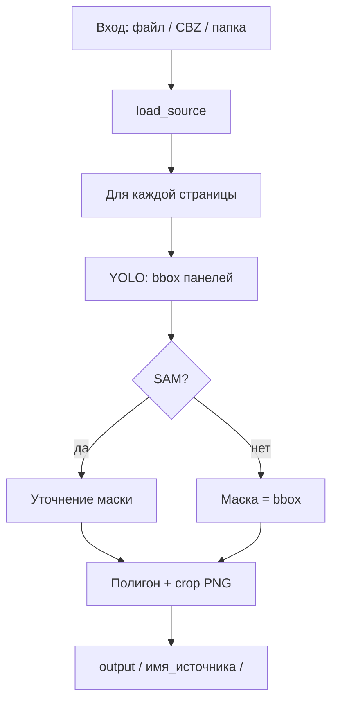

# ComicSplit — документация (актуальная)

**Версия документа:** 1.6 (июнь 2026) — блоки A, B0, B1, B4; TPSMM (B2); **Story 2a HITL**; Split reading_order  
**Статус приложения:** рабочий MVP — split (YOLO comic/manga + SAM) + anim (Real-ESRGAN / CUGAN / SPAN, 16:9, OpenCV / DepthFlow / TPSMM); пресеты **Стандарт / Качество**; Gradio :7860 и веб :8000 (API **v1.3**, вкладки Split / Upscale / Video / **Story 2a**); опционально Go CLI.

Этот документ описывает **текущую** сборку: установку и способы работы — **Gradio** (3 вкладки), **CLI split/anim**, **веб-редактор :8000** (Split / Upscale / Video / Story 2a), **Go CLI**.

Статус реализации по модулям: [IMPLEMENTATION_STATUS.md](IMPLEMENTATION_STATUS.md).  
Исторические материалы: [archive/](archive/) (`ComicSplit_Specification_v2.0.md`, `implementation_plan_mvp.md` и др.).

---

## 1. Назначение

**ComicSplit** — утилита для Windows, которая автоматически находит панели на страницах комикса и сохраняет каждую панель отдельным PNG с прозрачным фоном (альфа-канал).

**Вход:**

- одна страница: JPG, PNG;
- архив: CBZ, ZIP;
- папка с изображениями (лексикографический порядок файлов);
- CBR — через Python (нужен `rarfile` и `unrar` в системе).

**Выход:**

- PNG-панели в указанной папке;
- имена по шаблону из `config.yaml`, по умолчанию: `001_page_001_panel_01.png`;
- для каждой страницы — превью `_visualization.jpg` в подпапке `page_NNN/`.

**Режимы качества:**

| Режим | В config | В UI (пресет) | Скорость | Качество масок |
|-------|----------|---------------|----------|----------------|
| **Fast / Стандарт** | `quality_mode: fast` | Пресет «Стандарт», SAM выключен | Быстрее | Прямоугольник по bbox YOLO |
| **Accurate / Качество** | `quality_mode: accurate` | Пресет «Качество», SAM включён | Медленнее | Контур панели точнее |

Переключение пресетов — одной кнопкой в Gradio и веб-UI; эталон значений в `config/presets.yaml` (см. §5.1).

---

## 2. Требования

| Параметр | Минимум |
|----------|---------|
| ОС | Windows 10/11 (64-bit) |
| Python | 3.11 |
| RAM | 8 GB (рекомендуется 16 GB для CBZ 50+ стр.) |
| CPU | x64, без GPU (ONNX Runtime CPU) |
| Диск | ~200 MB под venv + ~80 MB под модели INT8 |

---

## 3. Структура проекта

```
SPLIT_PANELS_DEV/
├── main.py                 # Gradio :7860 — Split / Upscale / Video
├── pipeline.py             # Split ML + CLI
├── anim_pipeline.py        # Anim: upscale → 16:9 → MP4
├── config.yaml             # Split
├── config_animate.yaml     # Anim
├── config/presets.yaml     # Пресеты Стандарт / Качество
├── requirements.txt
├── test_page.jpg
├── exam_imgs/
├── models/                 # split ONNX (не в git)
├── models/anim/            # NCNN, MiDaS, TPSMM, ffmpeg (не в git)
├── anim/                   # upscale, harmonize, render, animate_*
├── utils/                  # config, anim_config, presets, io_helpers, path_resolve, ui_tooltips, path_dialog
├── api/server.py           # FastAPI v1.3 (:8000)
├── frontend/index.html     # Konva + вкладки Split/Upscale/Video/Story 2a
├── scripts/                # модели split + anim
├── cmd/comicsplit/         # Go CLI
├── ml_worker/main.py
├── benchmark.py
├── tests/
└── spec_s/
```

**Не в git** (`.gitignore`): `venv_*`, `output/`, `models/**/*` (кроме README), `out_ui/` (устаревший артефакт), `story_out*/`.

---

## 4. Установка (один раз)

Все команды — из корня проекта в **PowerShell**.

### 4.1. Виртуальное окружение

```powershell
cd D:\path\to\SPLIT_PANELS_DEV
python -m venv venv_311
.\venv_311\Scripts\activate
python -m pip install --upgrade pip
pip install -r requirements.txt
```

Рекомендуется один каталог окружения: `venv_311`. Старые `venv`, `venv_310` можно удалить.

### 4.2. Модели split

```powershell
Set-ExecutionPolicy -Scope Process -ExecutionPolicy Bypass
.\scripts\split_models_craft_scripts\download_models.ps1
python scripts\split_models_craft_scripts\quantize_models.py
```

Проверка: в `models/` три файла `*_int8.onnx` (см. `models/README.md`).  
**Подробно о всех моделях, ссылках и железе:** [MODELS_SPECIFICATION.md](MODELS_SPECIFICATION.md).

### 4.3. Модели anim (опционально, для апскейла и видео)

```powershell
powershell -ExecutionPolicy Bypass -File scripts\download_animate_models.ps1
python scripts\quantize_animate_models.py --verify
```

См. `scripts/MODELS_SETUP_GUIDE.md` и [MODELS_SPECIFICATION.md](MODELS_SPECIFICATION.md). DepthFlow: `pip install depthflow` (делает скрипт загрузки).

### 4.4. Прокси (если Gradio не открывается)

```powershell
$env:NO_PROXY = "127.0.0.1,localhost"
$env:no_proxy = "127.0.0.1,localhost"
```

---

## 5. Конфигурация (`config.yaml`)

| Параметр | Значение | Описание |
|----------|----------|----------|
| `quality_mode` | `fast` / `accurate` | YOLO или YOLO+SAM |
| `reading_order` | `true` / `false` | Сортировать панели |
| `reading_direction` | `ltr` / `rtl` | Западный комикс / манга |
| `max_workers` | `4` | Параллельный analyze страниц в архиве |
| `confidence_threshold` | `0.35` | Порог YOLO |
| `panel_detector` | `comic` / `manga` | Детектор панелей (пресеты не меняют) |
| `output_pattern` | см. файл | Шаблон имён PNG |

Пример имени: `{order:03d}_page_{page:03d}_panel_{panel:02d}.png` → `007_page_003_panel_02.png`.

CLI и Gradio читают этот файл при запуске. В Gradio и веб-UI можно переопределить SAM, RTL, пороги YOLO и anim-параметры; пресеты подставляют согласованный набор значений (§5.1).

### 5.1. Пресеты качества (`config/presets.yaml`)

Два встроенных пресета для быстрого переключения без ручного редактирования YAML:

| Пресет | ID | Split | Anim (основное) |
|--------|-----|-------|-----------------|
| **Стандарт** | `standard` | YOLO без SAM, `confidence_threshold: 0.35` | `animevideov3`, OpenCV zoom, harmonize `auto` |
| **Качество** | `quality` | YOLO + SAM, порог `0.30` | x4plus-anime ×4, DepthFlow `dolly`, harmonize `blurred_pillarbox` |

- **Gradio:** кнопки «Стандарт» / «Качество» в шапке; бейдж **MODE: STANDARD** или **MODE: QUALITY**; чекбокс «Сохранить в YAML» записывает пресет в конфиги на диск.
- **Веб :8000:** те же кнопки в шапке; бейдж режима; расширенные блоки (SAM, пороги YOLO, модель/GPU апскейла, harmonize, DepthFlow) показываются только в режиме «Качество».
- **API:** `GET /api/presets`, `GET /api/presets/{name}`, `POST /api/presets/apply?name=standard|quality`.
- Локальные переопределения (опционально): `config/presets.user.yaml` — не в git.

Подробнее: [MODELS_SPECIFICATION.md](MODELS_SPECIFICATION.md) §2.1 и §8.

### 5.2. Детекторы панелей (split)

| ID | Контент | Модель |
|----|---------|--------|
| `comic` | Franco-Belgian, American, цветные комиксы | `yolo_comic_int8.onnx` |
| `manga` | Японская манга, Manga109 | `yolo_manga_int8.onnx` |

Выбор в Gradio и :8000 (dropdown «Детектор панелей»). Пресеты **не** перезаписывают детектор. Экспорт манги: `scripts/export_manga_yolo.py`. Подробнее: [MODELS_SPECIFICATION.md](MODELS_SPECIFICATION.md) §1.2.

### 5.3. Апскейл NCNN (backend и модели)

| Backend | Когда использовать | Ключевые поля |
|---------|-------------------|---------------|
| `realesrgan` | По умолчанию, пакетная обработка | `model`: animevideov3 / anime_6B |
| `realcugan` | Line art, чёткие края | `cugan_noise`, `cugan_syncgap` |
| `span` | Максимальное качество NTIRE | `span_model_name`: spanx2 / spanx4 |

| Выбор (Real-ESRGAN) | NCNN `-n` | Масштаб |
|---------------------|-----------|---------|
| animevideov3 | `realesr-animevideov3` | ×2 или ×4 |
| x4plus-anime (anime_6B) | `realesrgan-x4plus-anime` | **только ×4** |

Параметр `upscale.tile_size` (0 = auto; 64/128/256) → `-t`. Скачивание CUGAN/SPAN: `scripts/download_upscale_backends.ps1`. Диагностика: `scripts\benchmark_upscale.ps1 -Quick`. Подробнее: [MODELS_SPECIFICATION.md](MODELS_SPECIFICATION.md) §2.

---

## 6. Способ 1 — Gradio (графический интерфейс)

Подходит для пробных прогонов без командной строки. **Три вкладки:** раскройка, апскейл панелей, сборка видео.

### 6.1. Запуск

```powershell
.\venv_311\Scripts\activate
$env:NO_PROXY = "127.0.0.1,localhost"
python main.py
```

В браузере: **http://127.0.0.1:7860**

### 6.2. Вкладки и общие элементы

| Элемент | Назначение |
|---------|------------|
| **Стандарт / Качество** | Пресеты качества; бейдж MODE в шапке |
| **Подсказки** | Иконка ⓘ / «!» у полей — краткое объяснение настройки |
| **Обзор…** | Нативный диалог Windows для выбора файла или папки (дополняет ручной ввод и drag-and-drop) |

| Вкладка | Назначение |
|---------|------------|
| **Split — раскройка** | CBZ/папка/страница → PNG панелей |
| **Upscale — апскейл** | Папка PNG → NCNN (Real-ESRGAN / CUGAN / SPAN) |
| **Video — оживление** | Папка PNG → harmonize 16:9 → MP4 + `storyboard.mp4` |

### 6.3. Split — элементы

| Элемент | Действие |
|---------|----------|
| **Источник** | JPG/PNG/CBZ/ZIP (drag-and-drop или «Обзор…») или путь к папке |
| **Папка вывода** | По умолчанию `output`; «Обзор…» |
| **MobileSAM** | Accurate (YOLO + SAM); виден в режиме «Качество» |
| **Пороги YOLO** | `confidence_threshold`, `iou_threshold` — блок «Дополнительно», режим «Качество» |
| **Детектор панелей** | `comic` или `manga` (не меняется пресетом) |
| **Порядок чтения / RTL** | Сортировка панелей |
| **Запустить** | Сохранение PNG на диск |
| **Результат** | Текст со списком путей |

### 6.4. Сценарий: одна страница (Split)

1. Запустить `python main.py`.
2. Загрузить `test_page.jpg` или свою страницу.
3. Папка вывода: `output`.
4. Нажать **Запустить**.
5. Открыть папку `output\<имя_файла>\` — там PNG и `_visualization.jpg`.

### 6.5. Сценарий: весь CBZ (Split)

1. Загрузить свой `.cbz` **или** указать путь к папке (в репозитории готового CBZ нет; для теста папки — `exam_imgs`).
2. Включить нужные опции (SAM, порядок чтения).
3. **Запустить**.
4. Результат: `output\<имя_комикса>\` — все панели с глобальной нумерацией `001_...`, `002_...`, подпапки `page_001/` с превью.

### 6.6. Upscale / Video в Gradio

Укажите **папку с PNG** после split. Режимы видео: `opencv_zoom`, `opencv_shake`, `static`, `depthflow`, **`tpsmm`** (нужен driving MP4). В «Качество»: backend апскейла (Real-ESRGAN / CUGAN / SPAN), GPU, harmonize, DepthFlow. TPSMM не включён в пресеты — выберите режим и укажите driving video вручную. По умолчанию в `config_animate.yaml`: `mode: opencv_zoom`. См. `config/presets.yaml`.

### 6.7. Ограничения Gradio

- Галерея превью в UI отключена (стабильность на Windows); пути к файлам — в поле «Результат».
- Для пакетной автоматизации удобнее CLI (способ 2).

---

## 7. Способ 2 — CLI (`pipeline.py`)

Подходит для скриптов, больших архивов и повторяемых задач.

### 7.1. Одна страница

```powershell
.\venv_311\Scripts\activate
python pipeline.py test_page.jpg output --order
```

| Флаг | Назначение |
|------|------------|
| `--sam` | MobileSAM (игнорирует `fast` в config, если указан) |
| `--order` | Сортировка по порядку чтения |
| `--rtl` | Порядок справа налево |

**Результат:** `output\test_page\001_page_001_panel_01.png`, ...

### 7.2. CBZ или папка

```powershell
python pipeline.py "D:\comics\book.cbz" output --order
python pipeline.py "D:\comics\pages_folder" output --order --rtl
```

**Результат:** `output\book\` (или `output\pages_folder\`) — все панели всех страниц.

### 7.3. Что происходит внутри



---

## 8. Структура выходных файлов

Пример после обработки CBZ `MyComic.cbz` в папку `output`:

```
output/
└── MyComic/
    ├── 001_page_001_panel_01.png
    ├── 002_page_001_panel_02.png
    ├── 003_page_002_panel_01.png
    ├── ...
    ├── page_001/
    │   └── _visualization.jpg    # маски на странице 1
    ├── page_002/
    │   └── _visualization.jpg
    └── ...
```

- **Глобальный `order`** — сквозной номер панели во всём комиксе.
- **page** — номер страницы в архиве (с 1).
- **panel** — номер панели на странице (порядок чтения).

PNG с альфа-каналом: фон прозрачный, панель вырезана по маске.

---

## 9. Способ 3 — веб-редактор (порт 8000)

Split с ручной правкой + апскейл, видео и **Story 2a** без Gradio. FastAPI **v1.3** + `frontend/index.html`. Функционал **согласован с Gradio** (пресеты, tooltips, детектор comic/manga, backend апскейла, TPSMM + driving MP4).

### 9.1. Запуск

```powershell
.\venv_311\Scripts\activate
$env:NO_PROXY = "127.0.0.1,localhost"
uvicorn api.server:app --reload --port 8000
```

Браузер: **http://127.0.0.1:8000**

### 9.2. Общие элементы UI

| Элемент | Поведение |
|---------|-----------|
| **Стандарт / Качество** | Пресеты; бейдж **MODE: STANDARD** / **MODE: QUALITY** в шапке |
| **Подсказки «!»** | Наведение или клик — всплывающее объяснение; закрытие по ESC, клику снаружи или крестику |
| **Обзор…** | `POST /api/path/pick` — нативный диалог на машине, где запущен uvicorn |
| **Пути** | Ручной ввод в текстовое поле (относительные пути предпочтительны при кириллице) |
| **Память UI** | Пути, настройки и активная вкладка сохраняются (`localStorage` + `config/ui_state.user.json`) |
| **↺ Сброс** | Кнопки сброса Split / Upscale / Video / Story 2a — заводские значения из config |

### 9.3. Вкладка Split

| Элемент | Поведение |
|---------|-----------|
| **Детекция** | `POST /api/process` — только координаты в память, **файлы на диск не пишет** |
| **Детектор** | `comic` / `manga`; `GET /api/split/options` |
| **Accurate (YOLO + SAM)** | Точный контур; блок «Качество» |
| **Пороги YOLO** | Слайдеры confidence / IoU — режим «Качество» |
| **Полигон (ломаная форма)** | Редактирование вершин; **экспорт по маске** только при включённом полигоне или после ручной правки |
| **Экспорт PNG** | `POST /api/export` → ваша папка `output_dir\<имя_страницы>\` |
| **Порядок панелей** | № на канвасе и в sidebar; ↑↓ и popup №; экспорт в порядке `reading_order` |
| **Sidebar** | Только **№ · точка · «Панель»**; `panel_id` и координаты — в tooltip при наведении |

После экспорта пути подставляются во вкладки Upscale и Video.

### 9.4. Вкладки Upscale и Video

| Вкладка | API | Результат |
|---------|-----|-----------|
| Upscale | `POST /api/upscale` | PNG (backend, CUGAN/SPAN поля); `GET /api/upscale/options` |
| Video | `POST /api/animate` | MP4 + `storyboard.mp4`; режимы incl. `tpsmm` + driving video |

### 9.5. Вкладка Story 2a

Story Analyzer Stage 2a: детекция speech bubbles + OCR + ручная правка. Подробнее: [STORY_ANALYZER_STAGE_2A.md](STORY_ANALYZER_STAGE_2A.md).

| Элемент | Поведение |
|---------|-----------|
| **Обработка** | `POST /api/story/stage_2a/process` — папка upscaled PNG → `stage_2a.json` |
| **Редактор** | Drag/resize bbox; chrome на рамке: **№ / ↻ re-OCR / ×** |
| **Текст** | Отдельное окно `#s2a-bubble-frame` (не привязано к bbox) |
| **Порядок** | `reading_order` баблов — как у панелей Split |
| **Ручной бабл** | «+ Добавить бабл» — рамка без рисования rect |
| **OCR** | SiliconFlow VLM по умолчанию; нужен `.env` с `SILICONFLOW_API_KEY` |
| **Persist** | Проект и пути — секция `story2a` в ui_state |

### 9.6. Пути к файлам

| Рекомендация | Пример |
|--------------|--------|
| Относительный путь | `exam_imgs\01_Asterix_the_Gaul_page-0004.jpg` |
| Папка панелей после export | `output\test_page` |
| Кнопка «Обзор…» | Открывает диалог на **сервере** (где запущен `uvicorn`), не в браузере |

При кириллице в путях — `utils/path_resolve.py`; при ошибке mojibake используйте относительные пути.

### 9.7. REST API (кратко)

| Метод | Путь | Назначение |
|-------|------|------------|
| POST | `/api/process` | Детекция (пороги YOLO в теле запроса) |
| POST | `/api/export` | PNG панелей |
| POST | `/api/upscale` | Апскейл (`backend`, model, scale, CUGAN/SPAN…) |
| POST | `/api/animate` | Видео (`mode`, `tpsmm_driving_video`, harmonize, depthflow…) |
| GET | `/api/split/options` | Детекторы + статус моделей split |
| GET | `/api/upscale/options` | Доступные backend апскейла |
| GET | `/api/models/setup` | Статус установки моделей |
| GET | `/api/presets` | Список пресетов |
| GET | `/api/presets/{name}` | Значения пресета для UI |
| POST | `/api/presets/apply` | Применить пресет к конфигам |
| GET | `/api/tooltips` | Тексты подсказок для полей |
| POST | `/api/path/pick` | Нативный выбор файла/папки (`kind`: `file` \| `folder`) |
| GET | `/api/image?path=` | Исходник для Konva |
| GET | `/api/video?path=` | MP4 для `<video>` |
| GET/PUT | `/api/ui/state` | Память UI (split, upscale, video, story2a) |
| POST | `/api/ui/state/reset` | Сброс секции UI |
| GET | `/api/story/stage_2a/options` | OCR-движки, языки, VLM-модель |
| POST | `/api/story/stage_2a/process` | Batch: панели → JSON |
| GET/PUT | `/api/story/stage_2a/{project}` | Чтение / сохранение правок |
| POST | `/api/story/stage_2a/{project}/reocr` | Re-OCR одного бабла |

---

## 10. Способ 4 — CLI anim (`anim_pipeline.py`)

Пакетная обработка уже нарезанных панелей (без UI).

```powershell
python pipeline.py exam_imgs panels --order
python anim_pipeline.py panels\exam_imgs story_out --mode opencv_zoom --scale 2
python anim_pipeline.py panels\exam_imgs story_out --no-upscale --mode static
python anim_pipeline.py panels\exam_imgs story_out --mode depthflow
```

| Флаг | Назначение |
|------|------------|
| `--mode` | `opencv_zoom`, `opencv_shake`, `static`, `depthflow`, `tpsmm` |
| `--tpsmm-driving-video` | MP4 для TPSMM (при `mode tpsmm`) |
| `--no-upscale` | Без апскейла |
| `--scale` | 2 или 4 (зависит от backend) |
| `--duration`, `--fps` | Длина клипа |

Выход: `story_out/upscaled/`, `harmonized/`, `animated/*.mp4`, при concat — `storyboard.mp4`.

Конфиг: `config_animate.yaml`.

---

## 11. Способ 5 — Go CLI (`comicsplit.exe`)

Пакетная обработка без Gradio: Go читает архив/папку, вызывает `ml_worker` (Python).

```powershell
go build -o comicsplit.exe ./cmd/comicsplit
.\comicsplit.exe --input exam_imgs --output panels --python .\venv_311\Scripts\python.exe --order
.\comicsplit.exe --input "D:\comics\book.cbz" --output panels --python .\venv_311\Scripts\python.exe --order --sam
```

| Флаг | Назначение |
|------|------------|
| `--input` | CBZ, ZIP, папка с изображениями или один JPG/PNG |
| `--output` | Папка для PNG |
| `--python` | Путь к `python.exe` с установленными зависимостями |
| `--order` | Сортировка панелей |
| `--sam` | MobileSAM |
| `--rtl` | Порядок справа налево |

**Ограничения:** CBR — только через `pipeline.py`; в репозитории нет файла `comic.cbz` — укажите реальный путь.

---

## 12. Инструменты разработчика

```powershell
python benchmark.py --dataset exam_imgs
python yolo_test.py test_page.jpg
python sam_test.py test_page.jpg
pytest -q
pyinstaller packaging/comicsplit.spec
```

---

## 13. Устранение неполадок

| Симптом | Решение |
|---------|---------|
| `Модель не найдена` (split) | `scripts\split_models_craft_scripts\download_models.ps1` + quantize |
| Anim upscale не стартует | `download_animate_models.ps1`, `quantize_animate_models.py --verify` |
| Gradio: `localhost is not accessible` | `$env:NO_PROXY="127.0.0.1,localhost"`, перезапуск `main.py` |
| Gradio: ошибка `charmap` / emoji | Обновить `main.py` и `pipeline.py` (логи без emoji); в консоли: `chcp 65001` |
| Пустой результат / 0 панелей | Снизить `confidence_threshold` в config; попробовать `--sam` |
| Медленно на больших страницах | Режим `fast`; для пакета — `max_workers` в config |
| Кириллица в путях | CLI/Gradio: `imdecode`/`tofile`; :8000 — `path_resolve`, лучше `exam_imgs\...` |
| :8000 «Файл не найден», путь `Âèäåî...` | Mojibake; относительный путь |
| Появляется лишняя `out_ui/` | Обновите `api/server.py` — детекция без записи на диск |
| SAM включён, экспорт с прозрачностью без «Полигон» | Обновите `frontend/index.html` — маска только в режиме полигона |
| DepthFlow: `No such command 'run'` | Обновите `anim/animate_depthflow.py` (CLI 0.9.x: `input … zoom … main`) |
| `comicsplit.exe`: comic.cbz not found | В репо нет `comic.cbz`; `--input exam_imgs` |
| Gradio: `Gallery` / schema `bool` | Gradio 5.x без Gallery |
| Диалог «Обзор…» не открывается (:8000) | Запускайте uvicorn на Windows с GUI; tkinter нужен на машине сервера |
| Пресет «Качество» — нет DepthFlow / SAM | Расширенные блоки скрыты в «Стандарт»; переключите пресет и проверьте бейдж MODE |

---

## 14. Зависимости (ключевые версии)

Зафиксированы в `requirements.txt`:

- `gradio` 5.x, `starlette` &lt; 0.47 (не 1.0)
- `onnxruntime`, `opencv-python`, `numpy`
- `fastapi`, `uvicorn` — для опционального API
- `PyYAML` — config

После смены `requirements.txt` всегда: `pip install -r requirements.txt`.

---

## 15. Краткая шпаргалка

| Задача | Команда |
|--------|---------|
| Gradio (split + anim) | `python main.py` → :7860 |
| Пресет «Качество» | Кнопка «Качество» в Gradio / :8000 |
| Split одна страница | `python pipeline.py test_page.jpg output --order` |
| Split CBZ/папка | `python pipeline.py D:\comics\book.cbz output --order` |
| Веб split + anim | `uvicorn api.server:app --port 8000` |
| Anim из панелей | `python anim_pipeline.py panels_dir story_out --mode opencv_zoom` |
| Go split batch | `.\comicsplit.exe --input exam_imgs --output panels --python .\venv_311\Scripts\python.exe` |
| Точные контуры (детекция) | `--sam` / Accurate |
| Экспорт по маске (:8000) | Включить «Полигон» или править форму |
| Манга RTL | `--rtl` |
| Детектор манга | `panel_detector: manga` в config или UI |
| Апскейл CUGAN/SPAN | Backend в UI «Качество» или `config_animate.yaml` |
| TPSMM | `--mode tpsmm --tpsmm-driving-video drive.mp4` |

**Split:** PNG в `output/<источник>/`. **Anim:** MP4 в `story_out/animated/`, склейка `storyboard.mp4`.
