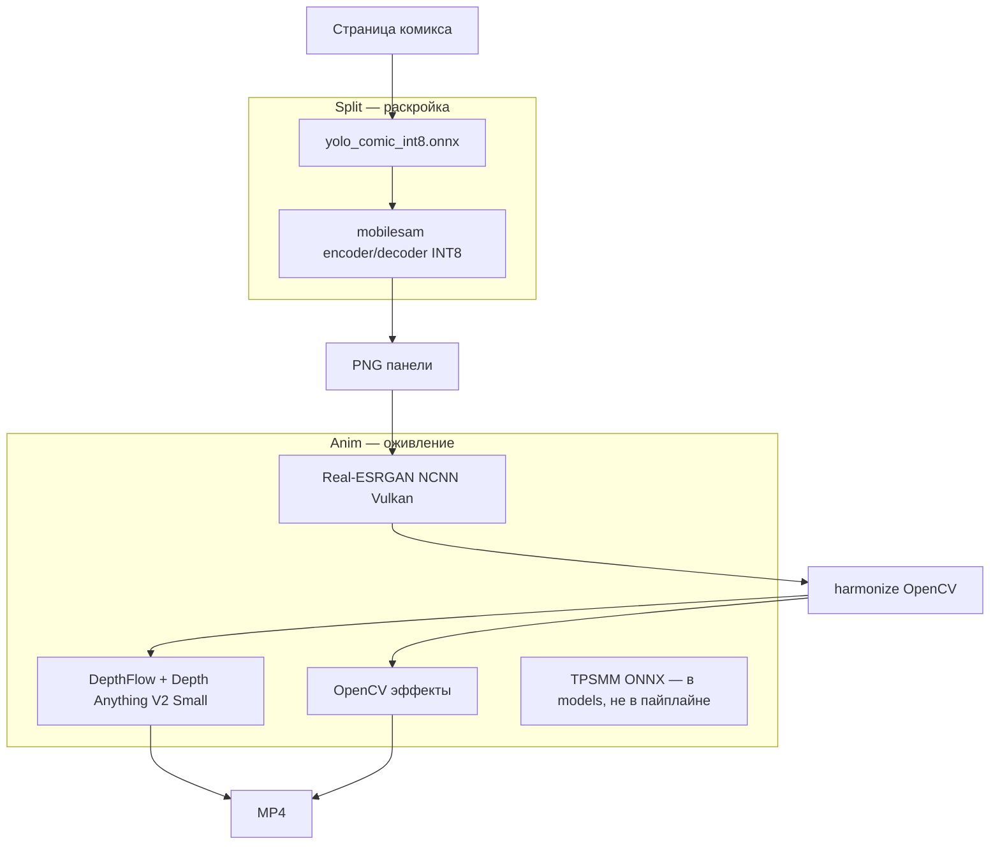

# Спецификация моделей ComicSplit

**Версия:** 1.1 (2 июня 2026)  
**Проект:** `SPLIT_PANELS_DEV`  
**Связанные документы:** [models/README.md](../models/README.md), [scripts/MODELS_SETUP_GUIDE.md](../scripts/MODELS_SETUP_GUIDE.md), [IMPLEMENTATION_STATUS.md](IMPLEMENTATION_STATUS.md)

Документ описывает **все ML- и inference-компоненты**, которые реально используются или подготовлены в репозитории, с ссылками на источники, оценкой пригодности под **целевое железо** и отдельным блоком **рекомендаций по улучшению качества** без перехода на CUDA/диффузию.

---

## Целевое железо (эталон проекта)

| Параметр | Значение |
|----------|----------|
| CPU | AMD Ryzen 5 5600H (6 ядер / 12 потоков, ~3.3 GHz) |
| GPU | AMD Radeon Graphics (iGPU, ~1 GB разделяемой VRAM) |
| RAM | 16 GB DDR4 |
| ОС | Windows 10/11 |
| Ограничения | **Нет NVIDIA CUDA**; диффузионные видео/SD-модели не рассматриваются |

**Легенда оценки «под вашу машину»**

| Символ | Значение |
|--------|----------|
| ⭐⭐⭐ | Оптимально: разумная скорость и качество на CPU / AMD Vulkan |
| ⭐⭐ | Допустимо: работает, но заметно медленнее или чуть хуже по качеству |
| ⭐ | Тяжело: только для единичных кадров / тестов |
| ❌ | Не подходит: требует CUDA, >8 GB VRAM дискретной GPU или нецелесообразно на 16 GB RAM |

---

## Обзор: где какая модель



| Этап | Модель / инструмент | Файл / пакет | Backend |
|------|---------------------|--------------|---------|
| Детекция панелей | YOLO (comic fine-tune) | `models/yolo_comic_int8.onnx` | ONNX Runtime CPU |
| Маска панели (Accurate) | MobileSAM | `mobilesam_*_int8.onnx` | ONNX Runtime CPU |
| Апскейл | Real-ESRGAN | `models/anim/upscale/*.bin` | NCNN + **Vulkan (AMD iGPU)** |
| Parallax | DepthFlow | `pip install depthflow` | OpenGL + depth estimator (PyTorch CPU) |
| Быстрая анимация | — | `anim/animate_opencv.py` | OpenCV |
| Motion transfer (задел) | TPSMM | `models/anim/tpsmm/*.onnx` | ONNX CPU (не подключён) |
| Карта глубины (задел) | MiDaS v2.1 small | `models/anim/depth/midas_*` | ONNX CPU (сейчас не в anim CLI) |
| Сборка видео | ffmpeg | `models/anim/ffmpeg/bin/` | CPU |

---

## 1. Split — детекция и маски

### 1.1 YOLO — детекция bounding box панелей

| | |
|--|--|
| **В проекте** | `models/yolo_comic_int8.onnx` |
| **Исходник** | Fine-tune [mosesb/best-comic-panel-detection](https://huggingface.co/mosesb/best-comic-panel-detection) → экспорт ONNX → dynamic INT8 |
| **Скрипт** | `scripts/split_models_craft_scripts/download_models.ps1`, `export_yolo.py`, `quantize_models.py` |
| **Роль** | Находит прямоугольники панелей на странице (класс panel) |
| **Вход** | 640×640, BGR |
| **Runtime** | ONNX Runtime, `CPUExecutionProvider` |

**Под ваше железо: ⭐⭐⭐**  
Лёгкая INT8-модель, основная нагрузка на CPU. На больших страницах время может превышать целевые 600 ms/стр. из спеки PoC — это нормально для Accurate+SAM, не для одного YOLO.

**Ссылки**

- Hugging Face: https://huggingface.co/mosesb/best-comic-panel-detection  
- Ultralytics export ONNX: https://docs.ultralytics.com/modes/export/

---

### 1.2 MobileSAM — уточнение контура (режим Accurate)

| | |
|--|--|
| **В проекте** | `mobilesam_encoder_int8.onnx`, `mobilesam_decoder_int8.onnx` |
| **Исходник** | Готовые ONNX: [Acly/MobileSAM](https://huggingface.co/Acly/MobileSAM) |
| **Оригинал** | [ChaoningZhang/MobileSAM](https://github.com/ChaoningZhang/MobileSAM) (~9.7M параметров, Tiny-ViT encoder) |
| **Роль** | По bbox YOLO строит маску → полигон для UI и (опционально) экспорта с альфой |
| **Включение** | `config.yaml` → `quality_mode: accurate`, Gradio «MobileSAM», :8000 «Accurate» |

**Под ваше железо: ⭐⭐**  
Encoder один раз на страницу + decoder на каждую панель. На 6–12 панелях это **секунды**, не миллисекунды. Для пакетной раскройки разумнее **fast** (только YOLO), SAM — когда нужны аккуратные края.

**Ссылки**

- ONNX на HF: https://huggingface.co/Acly/MobileSAM  
- Документация Ultralytics: https://docs.ultralytics.com/models/mobile-sam/  
- Демо CPU: https://huggingface.co/spaces/dhkim2810/MobileSAM  

---

## 2. Anim — апскейл

### 2.1 Real-ESRGAN (NCNN + Vulkan)

| | |
|--|--|
| **В проекте** | `models/anim/upscale/realesrgan-ncnn-vulkan.exe` + `models/anim/upscale/models/*.bin` |
| **Сборка** | [Real-ESRGAN ncnn-vulkan release](https://github.com/xinntao/Real-ESRGAN/releases/download/v0.2.5.0/realesrgan-ncnn-vulkan-20220424-windows.zip) |
| **Модели в конфиге** | `animevideov3` → `realesr-animevideov3` (веса `*-x2/x3/x4.bin`); `anime_6B` → `realesrgan-x4plus-anime` |
| **Конфиг** | `config_animate.yaml` → `upscale.model`, `scale`, `gpu_id`, `tile_size` |

| NCNN-модель (файлы в zip) | Назначение | Масштаб в приложении |
|---------------------------|------------|----------------------|
| `realesr-animevideov3-x2/x3/x4` | Быстрый апскейл, пакеты | ×2 или ×4 (`animevideov3`) |
| `realesrgan-x4plus-anime` | Точнее линии на статике | **только ×4** (`anime_6B` в UI) |

**Важно:** id `anime_6B` в конфиге — **не** отдельные веса `RealESRGAN_x4plus_anime_6B.pth`; в стандартном NCNN-zip их нет. Пары `RealESRGAN_x4plus_anime_6B.bin` в старых гайдах — устаревшее имя.

**Под ваше железо: ⭐⭐⭐ (с Vulkan)**  
Рекомендация: **Стандарт** — `animevideov3`, **×2**, `-g 0`. **Качество** — `anime_6B` (x4plus-anime), **×4**. При швах плиток — `tile_size: 128` в YAML; бенчмарк `scripts/benchmark_upscale.ps1`.

**Под ваше железо: ⭐ (fallback `-g -1`)**  
Чистый CPU через NCNN — в разы медленнее; только если Vulkan не видит GPU.

**Ссылки**

- Проект: https://github.com/xinntao/Real-ESRGAN  
- Anime-модели: https://github.com/xinntao/Real-ESRGAN/blob/master/docs/anime_model.md  
- Anime video v3: https://github.com/xinntao/Real-ESRGAN/blob/master/docs/anime_video_model.md  
- NCNN Vulkan: https://github.com/xinntao/Real-ESRGAN-ncnn-vulkan  

---

### 2.2 Real-CUGAN (NCNN + Vulkan) — подготовлено, UI позже

| | |
|--|--|
| **В проекте** | `models/anim/upscale/realcugan/realcugan-ncnn-vulkan.exe`, веса `models-se/` |
| **Скачивание** | `scripts/download_upscale_backends.ps1` |
| **Реестр** | `config/models_registry.yaml` → backend `realcugan` |
| **Verify** | `python scripts/verify_upscale_backends.py --backend realcugan` |
| **Роль** | Чистые края, line art, плоские цветовые зоны аниме/комикс |
| **Ключевые флаги CLI** | `-n` denoise (-1..3), `-s` scale, `-m` models-se/pro, `-c` syncgap, `-g`, `-t` |

**Под ваше железо: ⭐⭐⭐ (Vulkan)** — smoke на Vega ~3–4 с/панель ×2.  
**Бенчмарк:** `scripts/benchmark_upscale.ps1 -Quick` (все установленные backend).

**Ссылки:** https://github.com/nihui/realcugan-ncnn-vulkan  

---

### 2.3 SPAN (NCNN + Vulkan)

| | |
|--|--|
| **В проекте** | `models/anim/upscale/span/span-ncnn-vulkan.exe`, `models/` |
| **Скачивание** | `scripts/download_upscale_backends.ps1` |
| **Реестр** | `config/models_registry.yaml` → backend `span` |
| **Verify** | `python scripts/verify_upscale_backends.py --backend span` |
| **Дефолт smoke** | `-n spanx4_ch48 -s 4` |
| **Роль** | Efficient SR (NTIRE-class); сравнить с videov3 на своих панелях |

**Под ваше железо: ⭐⭐⭐ (Vulkan)**  
**В приложении:** dropdown backend «SPAN» в режиме «Качество»; бенчмарк `scripts/benchmark_upscale.ps1 -Quick`.

**Ссылки:** https://github.com/TNTwise/SPAN-ncnn-vulkan  

---

## 3. Anim — гармонизация 16:9

### 3.1 OpenCV (без нейросети)

| | |
|--|--|
| **В проекте** | `anim/harmonize.py` |
| **Режимы** | `blurred_pillarbox`, `dominant_color`, `smart_crop`, `auto` |

**Под ваше железо: ⭐⭐⭐**  
Только CPU, предсказуемо по RAM. Качество зависит от режима, не от весов модели.

---

## 4. Anim — оживление

### 4.1 OpenCV (zoom / shake / static)

| | |
|--|--|
| **В проекте** | `anim/animate_opencv.py` |
| **Режимы** | `opencv_zoom`, `opencv_shake`, `static` |

**Под ваше железо: ⭐⭐⭐**  
Самый быстрый путь к MP4. Качество «движения» скромное, зато стабильно на слабом GPU.

---

### 4.2 DepthFlow — parallax

| | |
|--|--|
| **В проекте** | `anim/animate_depthflow.py`, пакет `depthflow` |
| **Документация** | https://depth.brokensrc.dev/docs/ |
| **Репозиторий** | https://github.com/BrokenSource/DepthFlow |
| **Оценка глубины по умолчанию** | **Depth Anything V2 Small** (`depth-anything/Depth-Anything-V2-small-hf`) — подгружается при первом запуске |
| **Пресеты анимации** | `zoom`, `dolly` (`config_animate.yaml` → `depthflow_animation`) |
| **CLI в коде** | `input -i …` → `zoom`/`dolly` → `main --render -o …` (не команда `run`) |

**Под ваше железо: ⭐⭐ (качество) / ⭐ (скорость)**  

- **Плюсы:** parallax с прозрачностью глубины, использует **OpenGL** → AMD iGPU задействован для **рендера**, не для CUDA-ML.  
- **Минусы:** оценка глубины — **PyTorch на CPU** (DA-V2 Small); первый запуск качает веса с Hugging Face; на 1920×1080 и 3 s @ 24 fps — **минуты** на панель.  
- **RAM:** 16 GB достаточно для Small; Base/Large на CPU не рекомендуются.

**Ссылки**

- DepthFlow: https://github.com/BrokenSource/DepthFlow  
- Depth Anything V2: https://github.com/DepthAnything/Depth-Anything-V2  
- HF Small: https://huggingface.co/depth-anything/Depth-Anything-V2-Small-hf  
- Статья: https://arxiv.org/abs/2406.09414  

---

### 4.3 MiDaS v2.1 small (в `models/anim/depth/`, не основной путь)

| | |
|--|--|
| **В проекте** | `midas_v21_small_256.onnx`, `*_int8.onnx` |
| **Источник** | https://huggingface.co/julienkay/sentis-MiDaS/tree/main/onnx |
| **Оригинал** | https://github.com/isl-org/MiDaS |

Скачан и квантован для совместимости со спекой и будущим TPSMM. **Текущий DepthFlow использует Depth Anything V2**, не этот файл.

**Под ваше железо: ⭐⭐⭐** (если подключать вручную в ONNX) — легче DA-V2 Base, грубее детали.

---

### 4.4 TPSMM — motion transfer (подготовлено, не в UI)

| | |
|--|--|
| **В проекте** | `kp_detector.onnx`, `tpsmm_rel.onnx` (+ INT8) |
| **Источник** | https://github.com/instant-high/Thin-plate-spline-motion-model-ONNX |
| **Статус** | Модели в `models/anim/tpsmm/`; **код `anim_pipeline` не вызывает** |

**Под ваше железо: ⭐⭐**  
~50–120 MB INT8, inference на CPU возможен, но **медленно** и нужен driving video + желательно сегментация. Имеет смысл после интеграции `segment.py`.

---

## 5. Вспомогательное (не ML)

| Компонент | Назначение | Железо |
|-----------|------------|--------|
| **ffmpeg** | Кодирование MP4, concat storyboard | ⭐⭐⭐ CPU |
| **Konva / FastAPI** | UI, без моделей | ⭐⭐⭐ |

---

## 6. Сводная таблица: модель → железо → качество

| Модель | VRAM / GPU | RAM (ориентир) | Скорость на Ryzen 5600H + AMD iGPU | Качество для комикса |
|--------|------------|----------------|-------------------------------------|----------------------|
| YOLO INT8 | CPU | < 500 MB | Быстро | Хорошо (western/comic) |
| MobileSAM INT8 | CPU | +1–2 GB на страницу | Медленно | Отличные края |
| Real-ESRGAN animevideov3 | Vulkan | низкая | Быстро | Хорошо |
| realesrgan-x4plus-anime (`anime_6B`) | Vulkan | средняя | Только ×4 | **Линии на статике** |
| DepthFlow + DA-V2 Small | OpenGL + CPU ML | 4–8 GB пик | Медленно | **Лучший parallax** |
| OpenCV anim | CPU | минимум | Очень быстро | Базовое движение |
| TPSMM (будущее) | CPU | средняя | Медленно | Зависит от driving |

---

## 7. Рекомендации: улучшение качества на том же железе

Ниже — модели и настройки, которые **не требуют NVIDIA**, но могут дать прирост качества. Внедрение в код — отдельные задачи; часть уже переключается конфигом.

### 7.1 Split (раскройка)

| Рекомендация | Зачем | Железо | Ссылка |
|--------------|-------|--------|--------|
| Оставить **mosesb YOLO** для западных комиксов | Уже заточен под panel detection | ⭐⭐⭐ | [HF](https://huggingface.co/mosesb/best-comic-panel-detection) |
| Добавить/протестировать **manga-panel-detector-yolo26n** | Manga109-s, mAP50 ~0.96 на панелях, ~2.7 MB TFLite / лёгкий ONNX | ⭐⭐⭐ CPU | [HF leoxs22](https://huggingface.co/leoxs22/manga-panel-detector-yolo26n) |
| **Fast** без SAM для пакетов | Скорость, bbox достаточно для прямоугольного экспорта | ⭐⭐⭐ | `quality_mode: fast` |
| **Accurate + SAM** для финального экспорта | Только когда нужна маска / полигон | ⭐⭐ | `quality_mode: accurate` |
| Экспорт INT8 → FP16 ONNX (без квантования) | Чуть выше точность bbox/маски, больше размер и время | ⭐⭐ | переквантовать в `quantize_models.py` |

**Не рекомендуется на вашей машине:** полный SAM / SAM2 Large, YOLO11x, сегментационные модели >100M параметров на CPU для каждой страницы.

---

### 7.2 Апскейл

| Рекомендация | Зачем | Как включить |
|--------------|-------|--------------|
| **x4plus-anime (`anime_6B`) вместо videov3** | Чётче линии на статике | пресет «Качество», **scale 4** |
| **Масштаб x2 вместо x4** | Меньше артефактов, ~4× меньше пикселей на выходе | `scale: 2` |
| Проверить **Vulkan `-g 0`** | iGPU должен ускорять NCNN | `gpu_id: 0` в config |
| Альтернатива: **waifu2x-ncnn-vulkan** | Сравнимый стек (NCNN), иногда мягче на манге | https://github.com/nihui/waifu2x-ncnn-vulkan — отдельная интеграция |

**Не рекомендуется:** Real-ESRGAN PyTorch + CUDA, SD upscale, 4x на тысячах панелей без Vulkan.

---

### 7.3 Parallax и глубина

| Рекомендация | Зачем | Железо |
|--------------|-------|--------|
| Оставить **Depth Anything V2 Small** (как в DepthFlow) | Лучше MiDaS v2.1 по деталям | ⭐⭐ CPU |
| Пресет **`dolly`** vs **`zoom`** | Другой характер движения | ⭐⭐ |
| Уменьшить **duration / fps** для черновиков | 1 s @ 12 fps для превью | ⭐⭐⭐ |
| **Не** ставить DA-V2 Base/Large на CPU | Качество ↑, время ×3–10 | ⭐ |
| MiDaS INT8 в кастомном пайплайне | Только если отказ от DepthFlow | ⭐⭐⭐ |

---

### 7.4 Motion transfer (будущее)

| Рекомендация | Зачем | Железо |
|--------------|-------|--------|
| Интегрировать **TPSMM ONNX** уже в `models/anim/tpsmm/` | Реалистичное движение по driving video | ⭐⭐ |
| **MobileSAM** для маски персонажа | Отделить фон/персонажа перед TPSMM | ⭐⭐ |
| **LivePortrait** | Только лица, тяжёлый CPU | ⭐ |

---

### 7.5 Что сознательно не предлагать (железо)

| Технология | Причина |
|------------|---------|
| Stable Diffusion / AnimateDiff / SVD | CUDA, VRAM, минуты на кадр |
| ControlNet inpainting для 16:9 | Тяжёлый CPU/GPU |
| Полный Meta SAM2 Large | CPU непрактичен |
| TensorRT / CUDA EP | Нет NVIDIA GPU |

---

## 8. Практические пресеты под вашу машину

### В UI (рекомендуется)

Не правьте YAML вручную — используйте пресеты **Стандарт** / **Качество** в Gradio или веб-редакторе. Эталон значений: `config/presets.yaml` (см. [ROADMAP_QUALITY_BOOST.md](ROADMAP_QUALITY_BOOST.md)).

| Пресет | Split | Anim |
|--------|-------|------|
| **Стандарт** | fast, без SAM | animevideov3, OpenCV zoom |
| **Качество** | accurate + SAM | x4plus-anime ×4, blurred_pillarbox, DepthFlow dolly |

### Быстрый конвейер (ручной YAML, черновик)

```yaml
# config.yaml
quality_mode: fast

# config_animate.yaml
upscale:
  enabled: true
  scale: 2
  model: animevideov3
  gpu_id: 0
animation:
  mode: opencv_zoom
  duration: 2.0
  fps: 24
```

### Максимум качества (без CUDA, терпимое время)

```yaml
# config.yaml
quality_mode: accurate

# config_animate.yaml
upscale:
  scale: 2
  model: anime_6B   # NCNN: realesrgan-x4plus-anime, только scale 4
  gpu_id: 0
  tile_size: 128    # опционально после benchmark
animation:
  mode: depthflow
  depthflow_animation: dolly
  duration: 3.0
  fps: 24
```

Веб: экспорт по **маске** только с включённым «Полигон» или после правки вершин (см. [ComicSplit_Documentation.md](ComicSplit_Documentation.md) §9).

---

## 9. Диск и загрузка

| Группа | ~Размер на диске |
|--------|----------------|
| Split INT8 (3 ONNX) | ~80 MB |
| Anim NCNN + ONNX (без дубликатов) | ~150–300 MB |
| DepthFlow / DA-V2 (кэш HF) | +100–500 MB при первом parallax |
| **Итого** | ~0.5–1 GB + кэши |

Скрипты: split — `scripts/split_models_craft_scripts/`; anim — `scripts/download_animate_models.ps1`, `scripts/quantize_animate_models.py`.

---

## 10. Журнал документа

| Дата | Изменение |
|------|-----------|
| 2026-05-31 | Первая версия: все модели проекта, оценка под Ryzen 5600H + AMD iGPU, блок апгрейдов |
| 2026-06-02 | §2.1: честное соответствие anime_6B ↔ x4plus-anime; только ×4; tile_size, benchmark |

---

*При смене моделей в коде обновляйте этот файл и [models/README.md](../models/README.md).*
