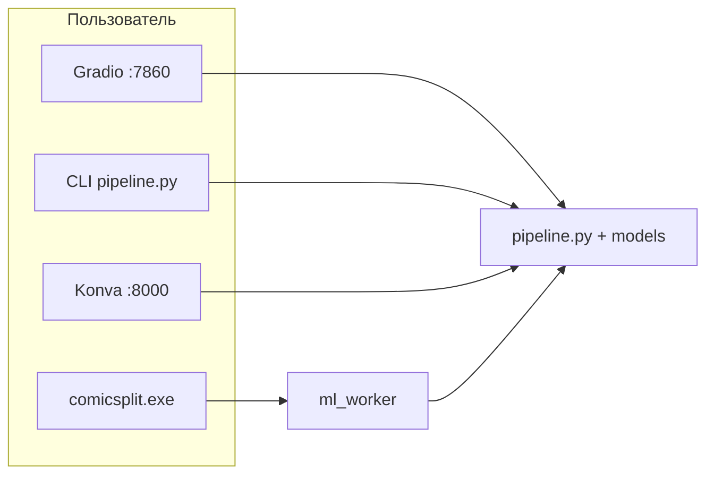

# Документация ComicSplit (`spec_s/`)

**Обновлено:** май 2026

## С чего начать

| Документ | Для кого | Содержание |
|----------|----------|------------|
| **[ComicSplit_Documentation.md](ComicSplit_Documentation.md)** | Пользователь, админ | Установка, **Gradio**, **CLI**, редактор :8000, Go CLI, выходные PNG |
| **[IMPLEMENTATION_STATUS.md](IMPLEMENTATION_STATUS.md)** | Разработчик | Что реализовано / не реализовано сейчас |
| [../README.md](../README.md) | Все | Быстрый старт в корне репозитория |

## Спецификация и планы (история + целевое видение)

| Документ | Статус | Описание |
|----------|--------|----------|
| [ComicSplit_Specification_v2.0.md](ComicSplit_Specification_v2.0.md) | Целевая архитектура | Go, Wails, gRPC, полный roadmap; **обновлён блок статуса фаз** |
| [implementation_plan_mvp.md](implementation_plan_mvp.md) | План MVP | Исходный 12-дневный план; **добавлена таблица «план vs факт»** |
| [work_on_my_side.md](work_on_my_side.md) | Архив | Gap-анализ; **обновлён под май 2026** |
| [Export_antigraviy_chat.md](Export_antigraviy_chat.md) | Архив | Экспорт чата планирования (без изменений) |

## Способы работы (актуально)

| # | Способ | Команда |
|---|--------|---------|
| 1 | Gradio | `python main.py` |
| 2 | Python CLI | `python pipeline.py <источник> output --order` |
| 3 | Редактор масок | `uvicorn api.server:app --port 8000` |
| 4 | Go CLI | `.\comicsplit.exe --input exam_imgs --output panels ...` |

---

## Журнал обновлений документации

| Дата | Файлы | Изменения |
|------|-------|-----------|
| 2026-05 (начало) | `ComicSplit_Documentation.md`, `README.md` | Первая актуальная пользовательская документация v1.0 |
| 2026-05 (текущее) | Все кроме `Export_antigraviy_chat.md` | Синхронизация с кодом: Gradio 5, path_resolve, Go CLI, статус фаз, исправление примеров `comic.cbz` → `exam_imgs` |
| — | `Export_antigraviy_chat.md` | Без правок (исторический архив) |
