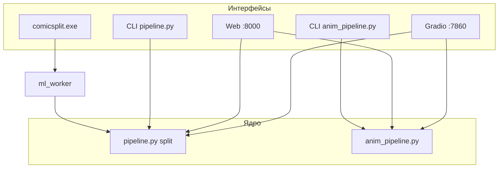

# Документация ComicSplit (`spec_s/`)

**Обновлено:** 31 мая 2026

## С чего начать

| Документ | Для кого | Содержание |
|----------|----------|------------|
| **[ComicSplit_Documentation.md](ComicSplit_Documentation.md)** | Пользователь, админ | Split + Anim: Gradio, CLI, :8000, Go, модели |
| **[IMPLEMENTATION_STATUS.md](IMPLEMENTATION_STATUS.md)** | Разработчик | Что реализовано / не реализовано |
| **[comic_panel_animation_spec.md](comic_panel_animation_spec.md)** | Anim-пайплайн | Спека оживления + **блок статуса реализации** |
| **[MODELS_SPECIFICATION.md](MODELS_SPECIFICATION.md)** | ML / инференс | Все модели, ссылки, пригодность под Ryzen 5600H + AMD iGPU, рекомендации по качеству |
| **[ROADMAP_QUALITY_BOOST.md](ROADMAP_QUALITY_BOOST.md)** | План работ | Пресеты Стандарт/Качество, UI Gradio+:8000, новые модели (manga YOLO, TPSMM) |
| [../README.md](../README.md) | Все | Быстрый старт в корне |
| [../CHANGELOG.md](../CHANGELOG.md) | Все | История релизов и правок |

## Спецификация и планы

| Документ | Статус | Описание |
|----------|--------|----------|
| [ComicSplit_Specification_v2.0.md](ComicSplit_Specification_v2.0.md) | Целевая архитектура | Go, Wails, gRPC; обновлён roadmap |
| [implementation_plan_mvp.md](implementation_plan_mvp.md) | План MVP | Исходный план + таблица «план vs факт» |
| [work_on_my_side.md](work_on_my_side.md) | Gap-анализ | Спека v2.0 vs код |
| [Export_antigraviy_chat.md](Export_antigraviy_chat.md) | Архив | Экспорт чата планирования (без правок) |

## Способы работы (актуально)

| # | Задача | Команда |
|---|--------|---------|
| 1 | Split Gradio | `python main.py` → :7860 |
| 2 | Split CLI | `python pipeline.py <источник> output --order` |
| 3 | Редактор split + anim | `uvicorn api.server:app --port 8000` |
| 4 | Anim CLI | `python anim_pipeline.py <panels_dir> story_out --mode opencv_zoom` |
| 5 | Go batch split | `.\comicsplit.exe --input exam_imgs --output panels ...` |

---

## Журнал обновлений документации

| Дата | Файлы | Изменения |
|------|-------|-----------|
| 2026-05 (начало) | `ComicSplit_Documentation.md`, `README.md` | Первая пользовательская документация |
| 2026-05-31 | Все рабочие доки + `CHANGELOG.md` | Anim-пайплайн, Gradio/веб 3 вкладки, API v1.1, убран `out_ui`, логика экспорта полигона, DepthFlow CLI |
| — | `Export_antigraviy_chat.md` | Архив без правок |
