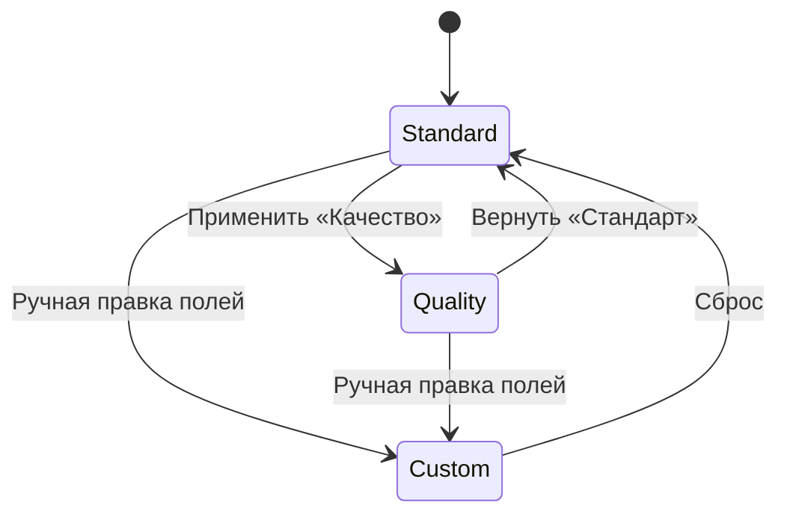
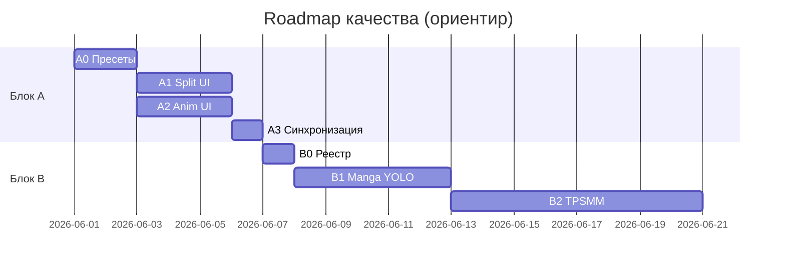

# Roadmap: раскрытие потенциала качества ComicSplit

**Версия:** 1.2 (2 июня 2026)  
**Целевое железо:** Ryzen 5 5600H, AMD Radeon iGPU, 16 GB RAM, Windows, без CUDA  
**Опора:** [MODELS_SPECIFICATION.md](MODELS_SPECIFICATION.md), [IMPLEMENTATION_STATUS.md](IMPLEMENTATION_STATUS.md)

> **Блок A закрыт (02.06.2026).** Следующий этап — **блок B** (реестр моделей, manga YOLO, TPSMM).

---

## Цель

Пошагово поднять качество выхода (PNG панелей, апскейл, MP4) **без смены железа**, с упором на:

1. **Блок A** — выжать максимум из уже скачанных моделей (конфиги + UI + **обратимые пресеты**).
2. **Блок B** — новые модели (скачать → подготовить → встроить → переключать в UI).

Оба интерфейса должны вести себя одинаково по смыслу: **Gradio (:7860)** и **веб-редактор (:8000)**.

---

## Принцип: пресеты и обратимость

Пользователь не должен вручную править YAML. Нужна пара режимов с **одной кнопкой туда-обратно**:

| Пресет | ID | Смысл |
|--------|-----|--------|
| **Стандарт** | `standard` | Текущие дефолты (быстро, предсказуемо) |
| **Качество** | `quality` | Рекомендации из MODELS_SPECIFICATION (медленнее, лучше картинка/видео) |

**Обратимость:**

- Переключатель или Radio: `Стандарт ⟷ Качество`.
- При переключении UI **подставляет** значения полей; при возврате — **восстанавливает** сохранённый снимок `standard` (не «забытые» ручные правки — опционально: «Сбросить к стандарту» / «Применить качество»).
- Опционально: `config/presets.yaml` в репозитории + `config/presets.user.yaml` (локальные правки, в `.gitignore`).



---

## Содержимое пресетов (эталон)

### Split (`config.yaml` + UI)

| Параметр | Стандарт | Качество |
|----------|----------|----------|
| `quality_mode` | `fast` | `accurate` |
| `reading_order` | `true` | `true` |
| `confidence_threshold` | `0.35` | `0.30` (чуть больше панелей) |
| UI: экспорт по маске | только при «Полигон» | то же (логика уже есть) |

### Anim (`config_animate.yaml` + UI)

| Параметр | Стандарт | Качество |
|----------|----------|----------|
| `upscale.model` | `animevideov3` | `anime_6B` (NCNN `realesrgan-x4plus-anime`) |
| `upscale.scale` | `2` | `4` (×2 для x4plus-anime не использовать) |
| `upscale.gpu_id` | `0` | `0` |
| `harmonize.mode` | `auto` | `blurred_pillarbox` (или `auto`) |
| `animation.mode` | `opencv_zoom` | `depthflow` |
| `animation.depthflow_animation` | `zoom` | `dolly` |
| `animation.duration` | `3` | `3` |
| `animation.fps` | `24` | `24` |
| `animation.intensity` | `0.3` | `0.4` |

### Веб Split (дополнительно к YAML)

| UI | Стандарт | Качество |
|----|----------|----------|
| Accurate (SAM) | выкл | вкл |
| Полигон | выкл | по желанию (не обязательно) |

---

## Блок A — потенциал имеющихся моделей

**Результат блока:** все значимые параметры доступны в Gradio и :8000; пресеты Стандарт/Качество работают; документация обновлена.

### Этап A0 — Инфраструктура пресетов (1–2 дня)

| # | Задача | Где |
|---|--------|-----|
| A0.1 | Файл `config/presets.yaml` (`standard`, `quality`) для split + anim | `config/presets.yaml` |
| A0.2 | `utils/presets.py`: load, apply, diff, snapshot текущего UI → dict | `utils/presets.py` |
| A0.3 | API `GET/POST /api/presets`, `POST /api/presets/apply?name=quality\|standard` | `api/server.py` |
| A0.4 | Сохранение «последних ручных» в `localStorage` / Gradio session | — отложено |

**Критерий готовности:** из CLI/API можно применить пресет и получить те же значения, что в таблице выше.

---

### Этап A1 — Split: настройки в UI (2–3 дня) ✅

**Сделано:** SAM, reading order, RTL, пороги YOLO, пресеты, tooltips, path pickers.

| # | Задача | Gradio | Web :8000 |
|---|--------|--------|-----------|
| A1.1 | Пресет «Стандарт / Качество» + подсказка | ✓ | ✓ (шапка или секция Split) |
| A1.2 | `quality_mode` fast/accurate ↔ чекбокс Accurate | ✓ | ✓ (связать с `use-sam`) |
| A1.3 | `confidence_threshold`, `iou_threshold` (слайдеры, «Дополнительно») | ✓ | ✓ (свёрнутый блок) |
| A1.4 | Подсказка: SAM ≠ экспорт маски; полигон отдельно | ✓ | ✓ (уже частично) |
| A1.5 | Передача порогов в `POST /api/process` (расширить schema) | — | ✓ |

**Критерий:** переключение пресета меняет чекбоксы; повторное «Стандарт» возвращает исходные значения.

---

### Этап A2 — Anim: настройки в UI (2–3 дня) ✅

**Сделано:** модель/GPU апскейла, harmonize, DepthFlow, intensity; ограничение ×4 для x4plus-anime; `tile_size` в конфиге.

| # | Задача | Gradio | Web :8000 |
|---|--------|--------|-----------|
| A2.1 | Пресет «Стандарт / Качество» на вкладках Upscale/Video | ✓ | ✓ |
| A2.2 | Выбор модели апскейла: `animevideov3` / `anime_6B` | ✓ Dropdown | ✓ |
| A2.3 | `gpu_id`: 0 (Vulkan) / -1 (CPU) | ✓ | ✓ |
| A2.4 | Harmonize: mode, blur_sigma, vignette (секция Video) | ✓ | ✓ |
| A2.5 | DepthFlow: `zoom` / `dolly`, intensity | ✓ | ✓ |
| A2.6 | API: передать новые поля в `/api/upscale`, `/api/animate` | ✓ | ✓ |

**Критерий:** пресет «Качество» — `anime_6B` (×4) + depthflow без правки YAML.

---

### Этап A3 — Синхронизация и тесты (1 день)

| # | Задача |
|---|--------|
| A3.1 | Gradio и :8000 читают одни и те же пресеты (`presets.yaml`) |
| A3.2 | Smoke: standard → quality → standard (сравнить config на диске или ответ API) |
| A3.3 | Обновить [ComicSplit_Documentation.md](ComicSplit_Documentation.md), [MODELS_SPECIFICATION.md](MODELS_SPECIFICATION.md) §8 |
| A3.4 | Параграф в [CHANGELOG.md](../CHANGELOG.md) |

---

### Итог блока A

```text
[x] A0 Пресеты в коде + API
[x] A1 Split UI (оба фронта)
[x] A2 Anim UI (оба фронта)
[x] A3 Синхронизация и доки
[x] A4 Апскейл: UI ×4 для x4plus-anime, guard в upscale.py, benchmark_upscale
[ ] A0.4 localStorage — опционально позже
```

**Оценка:** ~6–9 рабочих дней — **выполнено**.

---

## Блок B — новые модели и интеграция

**Результат блока:** альтернативные детекторы и motion transfer выбираются в UI; скрипты загрузки; verify.

### Этап B0 — Реестр моделей в приложении (1 день)

| # | Задача |
|---|--------|
| B0.1 | `config/models_registry.yaml`: id, путь, тип, железо, ссылка HF/GitHub |
| B0.2 | `utils/models_registry.py`: проверка «модель установлена» перед запуском |
| B0.3 | UI: серая кнопка + «Скачать модели» со ссылкой на скрипт, если файла нет |

---

### Этап B1 — Manga / альтернативный YOLO (3–5 дней)

| # | Задача |
|---|--------|
| B1.1 | Скрипт: export `leoxs22/manga-panel-detector-yolo26n` → ONNX INT8 |
| B1.2 | `pipeline.py`: выбор детектора `comic` \| `manga` (env или config) |
| B1.3 | UI: Dropdown «Детектор: Западный комикс / Манга» + пресет не ломает выбор |
| B1.4 | Benchmark на `exam_imgs` + 1 manga page |
| B1.5 | Док: когда какой детектор |

**Не в scope v1:** два детектора на одной странице.

---

### Этап B2 — TPSMM motion transfer (5–8 дней)

| # | Задача |
|---|--------|
| B2.1 | `anim/animate_tpsmm.py` — ONNX CPU, driving video / кадры |
| B2.2 | `anim_pipeline.py` + режим `tpsmm` |
| B2.3 | UI: mode `tpsmm`, путь к driving video, опционально сегментация |
| B2.4 | Gradio + :8000 + API поля |
| B2.5 | Предупреждение в UI: «медленно, N мин/панель» |

**Зависимость:** модели уже в `models/anim/tpsmm/` — verify `quantize_animate_models.py --verify`.

---

### Этап B3 — Опционально: сегментация + SAM2-tiny (позже)

| # | Задача | Приоритет |
|---|--------|-----------|
| B3.1 | `anim/segment.py` — MobileSAM по bbox для TPSMM | средний |
| B3.2 | SAM2-tiny ONNX для split (вместо MobileSAM) | низкий (тест CPU) |
| B3.3 | Split FP16 ONNX (без INT8) — флаг «Точность детекции» | низкий |

---

### Этап B4 — Waifu2x / второй апскейлер (опционально)

| # | Задача |
|---|--------|
| B4.1 | Оценка waifu2x-ncnn-vulkan на 10 панелях vs Real-ESRGAN 6B |
| B4.2 | При выигрыше — registry + dropdown backend |

---

### Итог блока B

```text
[ ] B0 Реестр моделей
[ ] B1 Manga YOLO
[ ] B2 TPSMM в пайплайне
[ ] B3 Segment / SAM2 / FP16 (по необходимости)
[ ] B4 Waifu2x (опционально)
```

**Оценка:** B0+B1+B2 ≈ 2–3 недели; B3–B4 по запросу.

---

## Матрица паритета UI (целевое состояние)

| Настройка | config | Gradio | Web | Пресет |
|-----------|--------|--------|-----|--------|
| Пресет Стандарт/Качество | presets.yaml | ✓ | ✓ | — |
| Split SAM / quality_mode | config.yaml | ✓ | ✓ | ✓ |
| YOLO пороги | config.yaml | ✓ | ✓ | ✓ |
| Детектор comic/manga | models_registry | B1 | B1 | — |
| Upscale model 6B/v3 | anim yaml | ✓ | ✓ | ✓ |
| Upscale scale, gpu_id | anim yaml | ✓ | ✓ | ✓ |
| Harmonize mode | anim yaml | ✓ | ✓ | ✓ |
| Anim mode + depthflow | anim yaml | ✓ | ✓ | ✓ |
| Подсказки ко всем полям | ui_tooltips | ✓ | ✓ | — |
| Выбор путей (Обзор…) | path_dialog | ✓ | ✓ | — |
| TPSMM + driving | — | B2 | B2 | — |

Легенда: ✓ реализовано; B1/B2 — блок B roadmap.

---

## Что вы не указали, но стоит заложить

| Тема | Зачем |
|------|--------|
| **Проверка моделей перед run** | Не падать в середине batch с «файл не найден» |
| **Оценка времени** | «~5 мин, 10 панелей, depthflow» в UI |
| **Лог последнего прогона** | Уже есть batch-log на :8000 — расширить на Gradio |
| **Экспорт/импорт пресета** | JSON для шаринга настроек между ПК |
| **Не трогать** | CUDA, SD, Wails — вне roadmap |

---

## Рекомендуемый порядок работ



**Практично:** сначала **весь блок A** (быстрый выигрыш без новых весов), затем **B1 → B2**.

---

## Связанные документы

| Документ | Роль |
|----------|------|
| [MODELS_SPECIFICATION.md](MODELS_SPECIFICATION.md) | Какие модели и зачем |
| [ComicSplit_Documentation.md](ComicSplit_Documentation.md) | Как пользоваться после внедрения |
| [scripts/MODELS_SETUP_GUIDE.md](../scripts/MODELS_SETUP_GUIDE.md) | Скачивание весов |
| [IMPLEMENTATION_STATUS.md](IMPLEMENTATION_STATUS.md) | Отмечать ✓ по мере закрытия этапов |

---

## Журнал

| Дата | Изменение |
|------|-----------|
| 2026-05-31 | Первая версия roadmap (блоки A и B, пресеты, паритет UI) |
| 2026-06-02 | Блок A закрыт: финал доков, апскейл ×4/x4plus-anime, tile_size, benchmark; A0.4 отложен |
